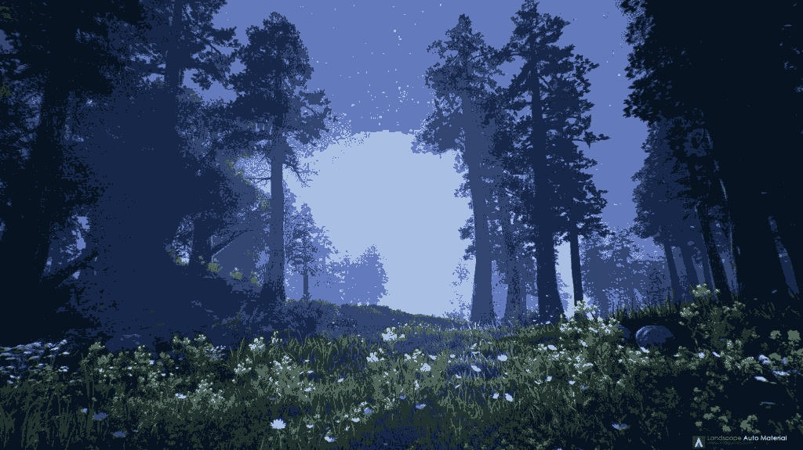

# Image Segmentation using K-Means Clustering

## Description
This project demonstrates image segmentation using the K-Means clustering algorithm in OpenCV. The input image is converted to the LAB color space for better color differentiation, and segmentation is performed using K-Means clustering.

## Requirements
Make sure you have the following dependencies installed before running the script:

```bash
pip install opencv-python numpy matplotlib
```

## Usage
1. Place an image file (e.g., `test.jpg`) in the same directory as the script.
2. Run the script using Python:

```bash
python image_segmentation.py
```

## Code Explanation
Below is the main script used for segmentation with a breakdown of each step:

```python
import cv2
import numpy as np
import matplotlib.pyplot as plt
import os

# 1. Read the image file
script_dir = os.path.dirname(os.path.abspath(__file__))  # Get the script directory
image_filename = "test.jpg"  # Image file name
image_path = os.path.join(script_dir, image_filename)  # Full image path
image = cv2.imread(image_path)  # Read the image using OpenCV

# 2. Convert the image color format
imageRGB = cv2.cvtColor(image, cv2.COLOR_BGR2RGB)  # Convert to RGB for matplotlib visualization
imageLAB = cv2.cvtColor(image, cv2.COLOR_BGR2LAB)  # Convert to LAB color space for better clustering

# 3. Pre-processing - Reshape the image for clustering
pixel_values = imageLAB.reshape((-1, 3))  # Flatten image to 1D array of pixel values
pixel_values = np.float32(pixel_values)  # Convert to float32 for K-Means

# 4. Define K-Means criteria
criteria = (cv2.TERM_CRITERIA_EPS + cv2.TERM_CRITERIA_MAX_ITER, 100, 0.2)
# Explanation:
# - cv2.TERM_CRITERIA_EPS: Stop when the centroid change is small enough
# - cv2.TERM_CRITERIA_MAX_ITER: Stop after 100 iterations
# - 0.2: Tolerance for centroid movement

# 5. Apply K-Means clustering
k = 7  # Number of clusters to segment the image
_, labels, centers = cv2.kmeans(pixel_values, k, None, criteria, 10, cv2.KMEANS_RANDOM_CENTERS)
# Explanation:
# - k: Number of color clusters
# - labels: Array indicating which cluster each pixel belongs to
# - centers: The RGB values of the clustered centroids

# 6. Reconstruct segmented image
centers = np.uint8(centers)  # Convert centroid values to uint8 format
labels = labels.flatten()  # Flatten the labels array
segmented_image = centers[labels]  # Assign each pixel to the corresponding cluster centroid
segmented_image = segmented_image.reshape(imageLAB.shape)  # Reshape back to original image shape

# 7. Convert segmented image back to BGR format for saving
segmented_image_bgr = cv2.cvtColor(segmented_image, cv2.COLOR_LAB2BGR)

# 8. Save segmented image
output_filename = "segmented_output.jpg"
output_path = os.path.join(script_dir, output_filename)
cv2.imwrite(output_path, segmented_image_bgr)
print(f"Segmented image saved as {output_path}")

# 9. Display the original and segmented images
plt.subplot(211), plt.imshow(imageRGB)
plt.title('Original Image'), plt.xticks([]), plt.yticks([])
plt.subplot(212), plt.imshow(segmented_image)
plt.title('Segmented Image'), plt.xticks([]), plt.yticks([])
plt.show()
```

## Results
### Original Image


### Segmented Image


## Adjusting K Value
You can adjust the `k` value in the script to change the segmentation output. Try different values to see how the segmentation varies.